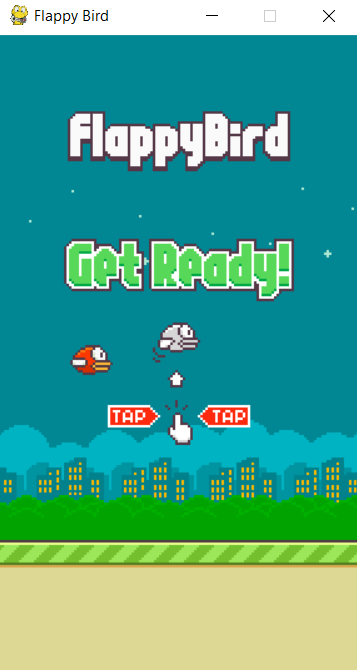

<h3 align= "center"><b> Game Programming Capstone Project 📑 </b></h3>

This repository is consists of the assignment(s) done for Game Programming 15CS323E during Spring 2020 at SRM IST. 

<h3 align= "center"><b> Topic: </b></h3>

An implementation of the popular Flappy Bird Game using Python

<h3 align= "center"><b>Snapshot: </b></h3>

<p align="center"></p>

<h2 align= "center"><b>Directions of Usage: </b></h2>

- Clone this repository ⏬
- Move inside 👉 the repo 
    - Open the Terminal 👩‍💻
    - and type ```cd smileplease```
- Now make sure you have all the dependencies🧱 
  - Type in the terminal:```pip install -r requirements.txt```
- Now start the game:
     - Type in the terminal ```python flappy_bird.py```


<h2 align= "center"><b>Supervisor</b></h2>

[Ms.R.Sangeetha](https://www.srmist.edu.in/engineering/dept-cse/faculty/r-anita) 

<h2 align= "center"><b>License📜</b></h2>

[MIT License](https://github.com/smaranjitghose/game_programming_project/blob/master/LICENSE)


<h2 align= "center"><b>Crafted with ❤ by Smaranjit Ghose</b></h2>

